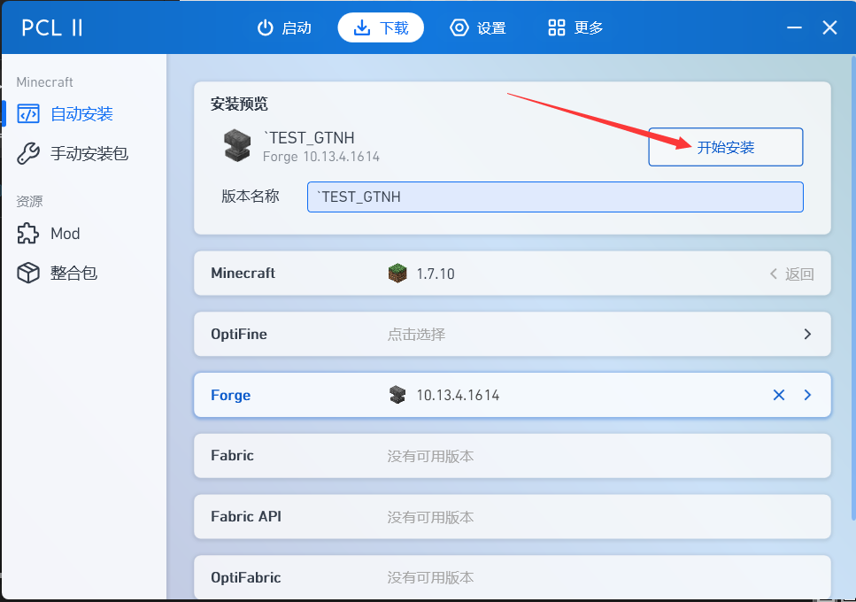
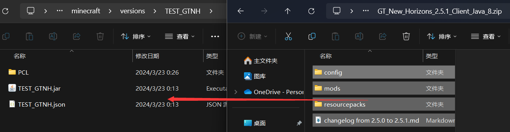
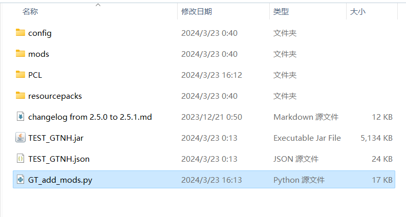
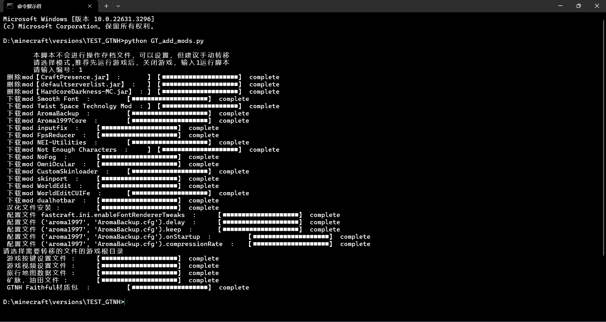
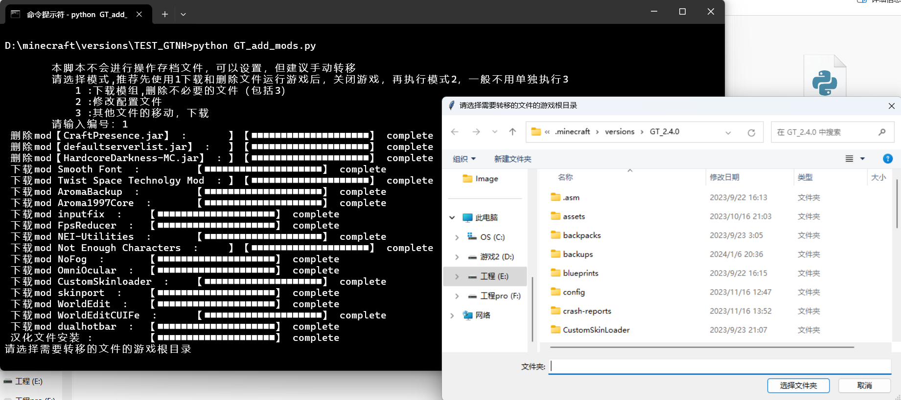
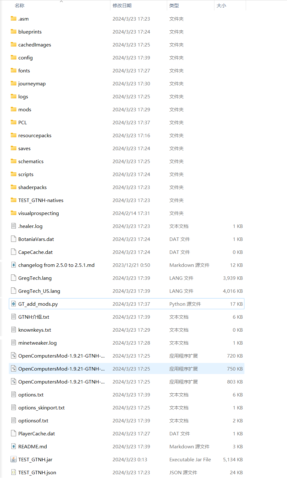

- [说明](#说明)
- [例子](#例子)
  - [1，安装游戏](#1安装游戏)
  - [2，下载GTNH整合包](#2下载gtnh整合包)
  - [3，下载脚本](#3下载脚本)
  - [4，启动游戏](#4启动游戏)
  - [5，运行脚本](#5运行脚本)
  - [6，Enjoy game](#6enjoy-game)
- [自定义文件处理](#自定义文件处理)

#### 说明
> 每次GTNH升级版本后，私货模组，材质包，配置文件，不需要的模组和文件每次都需要重新配置，修改。
 
> 但是使用本项目后，能够实现以上所有功能，且支持[自定义](#自定义文件处理)

> 运行需要科学上网进行下载文件，复杂度过高的版本升级不建议使用本项目，而是本地存储私货文件夹

更改的文件
- 添加的文件:

|                                         名称                                         |          注释           |
| :----------------------------------------------------------------------------------: | :---------------------: |
|                 [Smooth Font](https://www.mcmod.cn/class/1086.html)                  |        平滑字体         |
|          [Twist Space Technolgy Mod](https://www.mcmod.cn/class/12969.html)          |      扭曲空间科技       |
|                 [AromaBackup](https://www.mcmod.cn/class/1140.html)                  |        存档备份         |
|                 [Aroma1997Core](https://www.mcmod.cn/class/919.html)                 |      存档备份前置       |
|                    [inputfix](https://www.mcmod.cn/class/43.html)                    |      中文输入修复       |
|                  [FpsReducer](https://www.mcmod.cn/class/1815.html)                  |        FPS减速器        |
|            [Not Enough Characters](https://www.mcmod.cn/class/2198.html)             |      NEI 拼音搜索       |
|                    [NoFog](https://www.mcmod.cn/class/1820.html)                     |       移除所有雾        |
|                  [OmniOcular](https://www.mcmod.cn/class/1016.html)                  | 根据方块NBT信息显示内容 |
|               [CustomSkinloader](https://www.mcmod.cn/class/883.html)                |    万用皮肤补丁14.6a    |
|                   [skinport](https://www.mcmod.cn/class/2700.html)                   |      支持纤细模型       |
|                   [WorldEdit](https://www.mcmod.cn/class/609.html)                   |         创世神          |
|                [WorldEditCUIFe](https://www.mcmod.cn/class/612.html)                 |   创世神UI forge版本    |
|                  [dualhotbar](https://www.mcmod.cn/class/6392.html)                  |       双倍快捷栏        |
|             [Extra Player Render](https://www.mcmod.cn/class/3123.html)              |      额外玩家渲染       |
| [GTNH-Faithful-Textures](https://github.com/Ethryan/GTNH-Faithful-Textures/releases) |   GTNH Faithful材质包   |
|                                      以下已弃用                                      |                         |
|      [translate—GTNH](https://github.com/Kiwi233/Translation-of-GTNH/releases)       |        汉化文件         |
|           [NEI-Utilities](https://github.com/RealSilverMoon/NEI-Utilities)           |       NEI实用工具       |

- 删除的文件：

|          名称           |         注释         |
| :---------------------: | :------------------: |
|    CraftPresence.jar    |     discord相关      |
|  defaultserverlist.jar  | 默认添加的多人服务器 |
| HardcoreDarkness-MC.jar |     更真实的黑暗     |

- 修改的文件：

|         名称         |               注释                |
| :------------------: | :-------------------------------: |
|    fastcraft.ini     |    要与平滑字体兼容需修改配置     |
| angelica-modules.cfg | 安洁莉卡配置文件 防止平滑字体重影 |
|   AromaBackup.cfg    |          备份间隔 24小时          |
|                      |         备份最大数量 5个          |
|                      |         取消打开存档备份          |
|                      |           备份压缩率 9            |

- 移动的文件：

|       名称        |       注释       |
| :---------------: | :--------------: |
|    options.txt    | 游戏按键设置文件 |
|   optionsof.txt   | 游戏视频设置文件 |
| journeymap->data  | 旅行地图数据文件 |
| visualprospecting |  矿脉，油田文件  |

#### 例子
##### 1，安装游戏
安装1.7.10 forge版本的minecraft，optifine为可选，有需求就一起安装

##### 2，下载GTNH整合包
在[GTNH wiki](https://gtnh.huijiwiki.com/wiki/%E9%A6%96%E9%A1%B5)上下载所需的GTNH整合包版本，将其文件解压到刚安装的mc版本目录

##### 3，下载脚本
在[releases](https://github.com/Amber-siley/GTNH_add_mod_script/releases)下载脚本到mc版本目录

##### 4，启动游戏
启动游戏生成配置文件，以为部分文件是游戏运行生成的，当然也可以[自定义](#自定义文件处理)配置文件从老版本移动配置文件
##### 5，运行脚本
在mc版本目录，shift+右键，选择在终端打开或者使用powershell中打开，使用python运行脚本，[python下载](https://www.python.org/downloads/), 按照提示输入模式回车
```
python GT_add_mods.py
```
选择输入1进行运行脚本

选择老版本的游戏版本目录，用于移动老版本配置文件


##### 6，Enjoy game
GTNH start
#### 自定义文件处理
目前为了使用方便，没有添加配置文件来管理，配置项都在代码里，详见[代码注释](./GT_add_mods.py)
